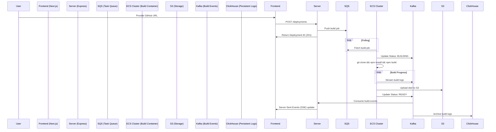

# System Architecture 🏗️

This document details the high-level architecture and the event-driven data flow of the Instant React Deploy system.

## 🚀 Deployment Lifecycle

The sequence below illustrates the process from user input to a live application URL.

## 🏗️ Components

### 1. **Web Dashboard (Next.js)**
- Built with Tailwind CSS and Radix UI.
- Displays live build status and real-time logs using SSE.
- Projects are persistent, allowing for multi-version deployment history.

### 2. **Orchestrator (Express Server)**
- Main management logic.
- **SQLite/PostgreSQL**: Stores project metadata and deployment states.
- **Kafka Consumer**: Listens for status updates from build containers and relays them to the frontend.
- **Log Service**: Proxies ClickHouse queries to show historical logs.

### 3. **Build Worker (Docker)**
- Lightweight, ephemeral container.
- Uses **Bun** or **Node.js** for high-speed builds.
- Automatically handles `npm`, `yarn`, or `pnpm` based on repository structure.
- **S3 Sync**: Uses AWS SDK to concurrently upload build artifacts (HTML, JS, CSS).

### 4. **S3 Reverse Proxy**
- Acts as the entry point for deployed sites (e.g., `user-repo.localhost:8080`).
- **Dynamic Routing**:
    - Extract subdomain from request.
    - Fetch corresponding files from S3.
    - Serves content with correct MIME types.
    - Handles SPA routing (redirecting 404s to `index.html`).

## 📡 Messaging & Logs

### Kafka Topics
- `status-updates`: Real-time state transitions (`QUEUED`, `BUILDING`, `READY`, `FAILED`).
- `build-logs`: Raw output from the build process for real-time streaming.

### Durable Storage
- **S3**: Permanent storage for build artifacts.
- **ClickHouse**: Optimized for high-throughput log insertion and fast analytical queries.
- **PostgreSQL**: Reliable metadata storage for projects and users.
