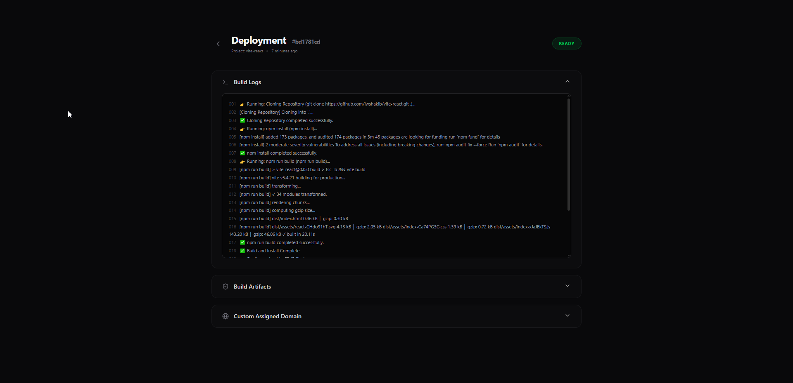
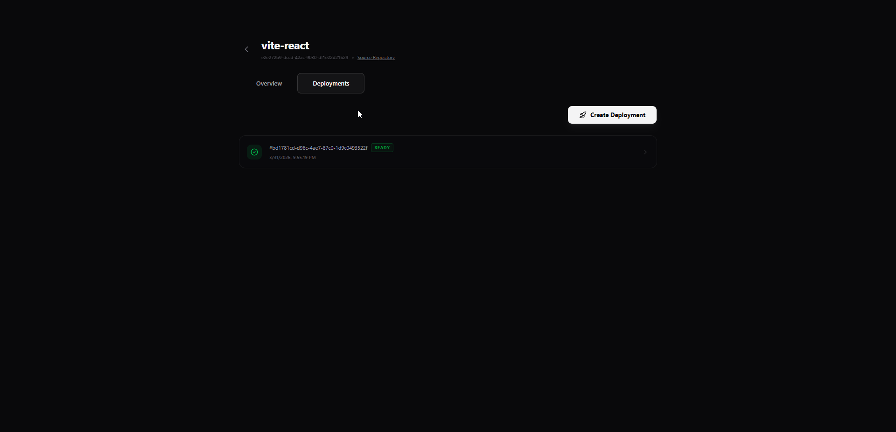
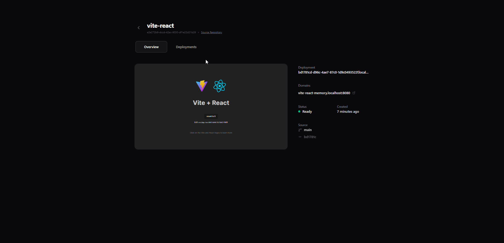
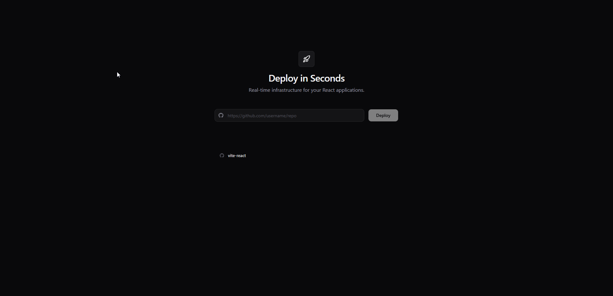

# Instant React Deploy 🚀

A high-performance, event-driven deployment infrastructure for React applications. Deploy your code in seconds with real-time build monitoring and automated S3-backed hosting.


|  |  |
| :---: | :---: |
| **Main Dashboard** | **Deployment Logs** |
|  |  |
| **Project Configuration** | **Dashboard Overview** |

## 🏗️ Core Architecture

This system allows users to deploy React repositories by simply providing a GitHub URL. It automates the entire lifecycle:
1.  **Orchestration**: Express Server receives requests and queues them via AWS SQS.
2.  **Build Execution**: AWS ECS (or local Docker) workers pull the code, build the project, and sync artifacts to S3.
3.  **Real-time Logs**: Build progress is streamed via Kafka to the dashboard using Server-Sent Events (SSE).
4.  **Edge Serving**: A specialized S3 Reverse Proxy serves the built apps via custom subdomains.

## 📂 Project Structure

| Component | Path | Description |
| :--- | :--- | :--- |
| **Web Dashboard** | [`apps/web`](./apps/web) | Next.js 16 Dashboard for managing projects and viewing live builds. |
| **Orchestrator** | [`apps/server`](./apps/server) | Main API server (Express) orchestrating the deployment lifecycle. |
| **Build Worker** | [`apps/build-container`](./apps/build-container) | The ephemeral build environment (Docker) that compiles the React app. |
| **Edge Proxy** | [`apps/s3-reverse-proxy`](./apps/s3-reverse-proxy) | Wildcard subdomain proxy for serving S3-hosted applications. |
| **Shared UI** | [`packages/ui`](./packages/ui) | Centralized design system used by the dashboard. |

## 🛠️ Getting Started

### Prerequisites

- **Node.js** v20+
- **pnpm** v9+ (Package Manager)
- **Docker** & **Docker Compose**
- **AWS Account** (S3, SQS, ECS configured)
- **Aiven/Upstash** (Kafka, Redis, Postgres, ClickHouse)

### Local Setup

1.  **Clone the Repository**:
    ```bash
    git clone https://github.com/lwshakib/react-app-deployment-system-architecture.git
    cd react-app-deployment-system-architecture
    ```

2.  **Install Dependencies**:
    ```bash
    pnpm install
    ```

3.  **Environment Variables**:
    Copy `.env.example` to `.env` in each application folder under `apps/`. Update with your actual credentials.
    ```bash
    cp apps/server/.env.example apps/server/.env
    cp apps/web/.env.example apps/web/.env
    cp apps/s3-reverse-proxy/.env.example apps/s3-reverse-proxy/.env
    ```

4.  **Run Infrastructure**:
    ```bash
    docker-compose up -d
    ```

5.  **Start Services**:
    Run all services in development mode using Turbo:
    ```bash
    pnpm dev
    ```

## 📖 Detailed Documentation

- [System Architecture](./ARCHITECTURE.md) - Deep dive into data flow and diagrams.
- [AWS Setup Guide](./AWS_CONFIGURATION.md) - Step-by-step infrastructure provisioning.
- [Contributing](./CONTRIBUTING.md) - How to help improve the system.
- [Code of Conduct](./CODE_OF_CONDUCT.md) - Our community standards.

## 📄 License

This project is licensed under the MIT License - see the [LICENSE](LICENSE) file for details.
